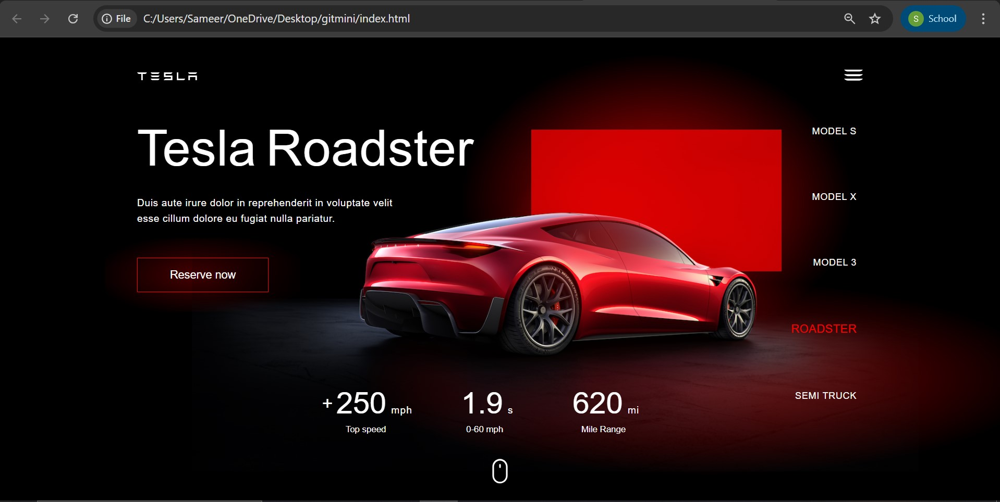

If not, you can include screenshots of the final result in the **Output Screenshot** section below.

##  🛠 Workflow Simulation
1. **Project Idea & Research**  
   - Chosen the "Animated Tesla Landing Page" project idea.
   - Researched layout and animations on Coding Stella’s tutorial. :contentReference[oaicite:0]{index=0}

2. **HTML Structure**  
   - Created `index.html`: header, hero section with background image or video, navigation, main content.

3. **Styling with CSS**  
   - Developed `style.css`: full-screen hero design, flexbox or grid layouts, typography, color schemes.
   - Added keyframe animations for smooth fades, sliding text, and hover effects.

4. **JavaScript Enhancements**  
   - Added interactivity (e.g., scroll-triggered animations, dynamic hero transitions).
   - Initialized animations on page load or upon scroll.

5. **Testing & Refinement**  
   - Checked responsiveness across devices (mobile, tablet, desktop).
   - Tuned animation timing, checked browser compatibility, optimized assets.

6. **Final Touches & README Preparation**  
   - Captured screenshots or video of final design.
   - Prepared README.md with project summary and workflow steps (this file).

##  Output Screenshot

